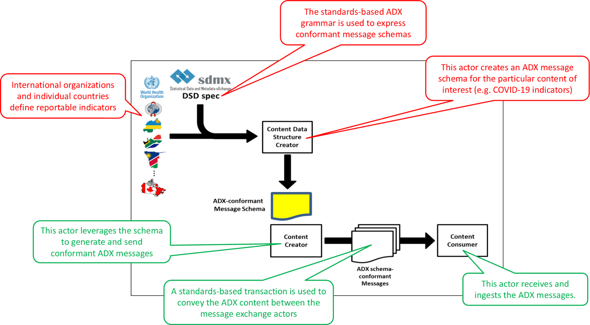

% Volume-1 ADX for COVID
% Bob Jolliffe; Derek Ritz; James Kariuki
% 2020-06-07

# Overview
The ADX for COVID profile is a *content* profile based on the Aggregate Data Exchange (ADX) specification. It defines a message schema for disaggregated data element reports that may be generated by point of service digital health solutions that collect weekly aggregate reports or summarize content collected electronically as per the WHO COVID-19 person-centric case reporting form. 

# Concepts

{width=80%}

*Figure 1: ADX actors and their roles*

The actors defined in the ADX specification, and their respective roles, are described in Figure 1. The “design-time” schema development processes are illustrated by the red comments and the “run-time” schema-conformant message exchange workflows are illustrated by the green comments.

Following the “red” workflow in Figure 1, the ADX for COVID content specification (this profile) represents an ADX-conformant Message Schema (highlighted in yellow in the figure). It is a computable representation of the weekly reportable indicators defined by the WHO for COVID surveillance reporting guidelines [^1]. This data reporting specification relies on the underlying case report specification, which has also been defined by WHO. For this content profile, WHO is the organization defining the reportable indicators and the QRPH committee is leveraging tooling (acting as a Content Data Structure Creator) to generate the ADX schema [^2]. 

Following the “green” workflow in Figure 1, a point of service digital health application (playing the role of a Content Creator actor) would leverage this ADX schema to generate conformant COVID-19 aggregate data report messages. These are then submitted to a health information management system (HMIS), which plays the role of a Content Consumer actor.

[^1]: https://www.who.int/emergencies/diseases/novel-coronavirus-2019/technical-guidance/surveillance-and-case-definitions]
[^2]: In support of this work item, IHE has reached out to SNOMED International for assistance in mapping concepts defined in the WHO case report form. This content specification leverages the SNOMED codes recommended by them.]

# Use Cases
Three key use cases are supported by this ADX content profile.

1. A country’s Ministry of Health (MOH) has implemented an electronic aggregate data reporting form based on WHO’s normative specification. On a weekly basis, content is captured in the data report form and conformant ADX messages are submitted to the MOH’s health management information system (HMIS). The MOH is able to leverage the HMIS to inform its actions to fight the COVID-19 pandemic. 

2. A country’s Ministry of Health (MOH) has implemented an electronic person-centric case reporting (eCR) form based on WHO’s normative COVID-19 case reporting form. On a weekly basis, aggregate data reports are generated by the eCR application and conformant ADX messages are submitted to the MOH’s health management information system (HMIS). The MOH is able to leverage the HMIS to inform its actions to fight the COVID-19 pandemic. 

3. On a weekly basis, a country MOH leverages its national HMIS to generate an ADX-conformant aggregate data report which it submits to WHO.

# Security Considerations
Aggregate data reports based on this ADX content specification do not contain identifiable person-centric information. Even so, the aggregate data reports are securely submitted using the QRPH-53 transaction (based on HTTPS). No other security considerations are identified.

# Cross-Profile Considerations
Not applicable. 
